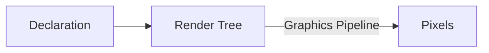
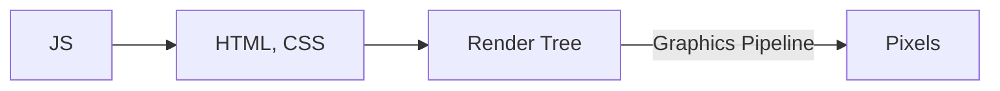
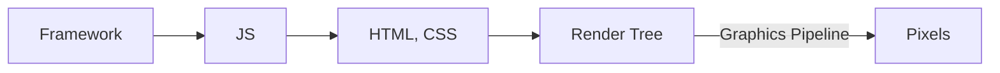
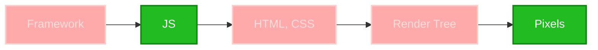

# Immediate Mode Rendering Pattern

Who: Erik

Product: HeavyGoods.net

Lang: Typescript

<!--
SCRIPT IDEA

- rendering, how it happens (in more complex systems)
  -> declare the ui somehow
  -> render tree gets build from that declaration (that is typically not accessible to the user)
  -> some advanced graphics pipeline transforms the render tree into pixels
  => super complex, lots of indirection, tons of code, efficient (only changed pixels are rerendered, pixels are scrolled with hardware acceleration, ...)

- what if everything could be simpler
  - declare UI
  - ~~render tree~~
  - ~~graphics pipeline~~
  => directly put pixels on a screen

- try it:
  - button and label on canvas
  ```
      document.body.innerHTML = '<canvas />'

      const canvas = document.getElementsByTagName('canvas')[0]
      const ctx = canvas.getContext('2d')

      ctx.strokeRect(1,1, 100, 20)
      ctx.fillText('OK', 30, 15)

      ctx.onclick = ({offsetX, offsetY}) => {
        if (offsetX > 1 && offsetX < 100 && offsetY > 1 && offsetY < 20) {
          console.log('click')
        }
      }
  ```

  - simple at the beginning but explodes with each item added
  - changing, maintaining such a hardwired thing -> not possible
  - is there a way to make this better without adding tons of indirection?

-> functional programming 💕
-> use the stack as our render tree to bring order into the chaos

  ```
  function Button(canvas, ctx, {x, y, width, height, label}) {
     ctx.strokeRect(x, y, x + width, y + height)
     ctx.fillText(label, x + width / 2, y + height / 2 + 10)
  }
  ```

-  stack layout

- use transformation matrix
- everything looks pretty "declarative" / DSLly
- replace the context with a proxy for additional benefits

-->

---

# Rendering (with a pipeline) 1



<!--

- rendering, how it happens (in more complex systems)
  1. DECLARE the ui somehow
  2. render tree gets build from that declaration (HIDDEN from user)
  3. some advanced GRAPHICS PIPELINE transforms the render tree into
  4. PIXELS on screen (actually calls to your OS graphics abstraction)
     - nobody sets pixels, its always regions (aka buffers) of pixels
=> super complex, lots of indirection, tons of code, efficient (only changed pixels are rerendered, pixels are scrolled with hardware acceleration, ...)

AUDIENCE

- put HTML, CSS, JS in this diagram

-->

---

# Rendering (with a pipeline) 2



<!--

- and more complexities
- render tree is also called the scenegraph (in game engines)

-->

---

# Rendering (with a pipeline) 3



<!--

- add your js of the day on top

-->

---


<!--

- chrome graphics pipeline from https://developer.chrome.com/docs/chromium/renderingng-architecture

-->

---

# Oh No

- everything is sooo complex 🤯
- what if we're tasked creating the pixels ourselves?

<v-click>

Imagine we're the new Luddites: 

</v-click>

<v-click>
to the rescue: "Immediate mode"



</v-click>

<!--

- slang for "direct access" to pixels
  - not sure where I picked up the term, it was years ago
- weg mit den mechanischen webstühlen!!!

-->

---

# Immediate Mode Code

```js
document.body.innerHTML = '<canvas style="background-color: white" />';

const canvas = document.getElementsByTagName("canvas")[0];
const ctx = canvas.getContext("2d");
```

<v-click>
```js
ctx.strokeRect(1, 1, 100, 20);
ctx.fillText("OK", 30, 15);
```
</v-click>

<v-click>
```js
canvas.onclick = ({ offsetX, offsetY }) => {
  if (offsetX > 1 && offsetX < 100 && offsetY > 1 && offsetY < 20) {
    console.log("click");
  }
};
```
</v-click>

<!--

- a simple button which can be clicked
- straight up move pixels with our bare hands
- click only logs to the console
- ui is completely static

DEMO ON NEXT SLIDE

-->

---

# Immediate Mode Code

<Example1 />

---

# State change

```js
const state = { ok: true };
```

```js
setInterval(
  () => {
    ctx.clearRect(0, 0, canvas.width, canvas.height);
    ctx.strokeRect(1, 1, 100, 20);
    ctx.fillText(state.ok ? "OK" : "NOT OK", 30, 15);
  },
  (1 / 60) * 1000, // 60Hz
);
```

```js
canvas.onclick = ({ offsetX, offsetY }) => {
  if (offsetX > 1 && offsetX < 100 && offsetY > 1 && offsetY < 20) {
    state.ok = !state.ok;
  }
};
```

<!--

IMPROVED:
- simple global state
  - not the only solution to state but the most simple one
- a render loop

DEMO ON NEXT SLIDE

-->

---

# State change

<Example2 />

---

# Nesting

```js
const state = { ok: [true, true, false] };
```

```js
setInterval(
  () => {
    ctx.clearRect(0, 0, canvas.width, canvas.height);
    for (const i of [0, 1, 2]) {
      ctx.strokeRect(1, 1 + 25 * i, 100, 20);
      ctx.fillText(state.ok[i] ? "OK" : "NOT OK", 30, 15 + 25 * i);
    }
  },
  (1 / 60) * 1000, // 60Hz
);
```

<v-click>
```js
canvas.onclick = ({ offsetX, offsetY }) => { ... }
```
<div class="absolute top-80 left-80">
<span class="text-5xl">🤮</span>
</div>
</v-click>

<!--

- keeping manually track of elements -> not good, not possible (for me)
  - and this is only a really simple 1 level nesting case over a basic loop,
    not even a more complex layout algo

-->

---

# Functional 💕 Programming

```js
function button(env, { x, y, width, height, label, onclick }) {
  env.ctx.strokeRect(x, y, width, height);
  env.ctx.fillText(label, x + 30, y + 15);

  env.onclick.push(({ offsetX, offsetY }) => {
    if (
      offsetX > x &&
      offsetX < x + width &&
      offsetY > y &&
      offsetY < y + height
    ) {
      onclick();
    }
  });
}
```

<!--

- good ol divide and conquer:
- combine simple elements into more complex ones
- let the container (`stackLayout`) pass an offset into an element
- element knows where it is so it can capture clicks

-->

---

# FP 💕 - `Container`

```js
function stackLayout(env, { children, height }) {
  let y = 1;

  for (let i = 0; i < children.length; i++) {
    const c = children[i];

    c(env, { y });

    y += height;
  }
}
```

<!--

- do this for every "Component"

-->

---

# FP 💕 - `Composition`

```js
function root(env) {
  stackLayout(env, {
    height: 30,
    children: [0, 1, 2].map(
      (i) =>
        (env, { y }) =>
          button(env, {
            x: 1,
            y,
            width: 100,
            height: 20,
            label: state.ok[i] ? `OK ${i}` : `NOT OK ${i}`,
            onclick: () => {
              state.ok[i] = !state.ok[i];
            },
          }),
    ),
  });
}
```

<!--

- use the "Components" to build sth. complex
- needs lots of wiring

-->

---

# FP 💕 - `render1`

```js
function render1(canvas, root) {
  const onclick = [];
  const ctx = canvas.getContext("2d");

  ctx.clearRect(0, 0, canvas.width, canvas.height);

  root({ ctx, onclick });

  canvas.onclick = (ev) => onclick.forEach((c) => c(ev));
}
```

<!--

- one step of the render loop
- collecting all clicks on the canvas and resetting them after each frame

-->

---

# FP 💕 - `Loop`

```
let state = {ok: [true, true, false]}

setInterval(
    () => {
      render1(canvas, root);
    },
    (1 / 60) * 1000, // 60Hz
  );
```

<!--

- aaand the render loop

-->

---

# FP 💕

<Example3 />

<!--

- it works
- looks a lot like react lol

-->

---

# Why?

<div class="text-green text-2xl flex">
<svg xmlns="http://www.w3.org/2000/svg" width="1em" height="1em" viewBox="0 0 32 32">
	<path fill="currentColor" d="M16 3C8.832 3 3 8.832 3 16s5.832 13 13 13s13-5.832 13-13S23.168 3 16 3m0 2c6.087 0 11 4.913 11 11s-4.913 11-11 11S5 22.087 5 16S9.913 5 16 5m-1 5v5h-5v2h5v5h2v-5h5v-2h-5v-5z" />
</svg>
<svg xmlns="http://www.w3.org/2000/svg" width="1em" height="1em" viewBox="0 0 32 32">
	<path fill="currentColor" d="M16 3C8.832 3 3 8.832 3 16s5.832 13 13 13s13-5.832 13-13S23.168 3 16 3m0 2c6.087 0 11 4.913 11 11s-4.913 11-11 11S5 22.087 5 16S9.913 5 16 5m-1 5v5h-5v2h5v5h2v-5h5v-2h-5v-5z" />
</svg>
<svg xmlns="http://www.w3.org/2000/svg" width="1em" height="1em" viewBox="0 0 32 32">
	<path fill="currentColor" d="M16 3C8.832 3 3 8.832 3 16s5.832 13 13 13s13-5.832 13-13S23.168 3 16 3m0 2c6.087 0 11 4.913 11 11s-4.913 11-11 11S5 22.087 5 16S9.913 5 16 5m-1 5v5h-5v2h5v5h2v-5h5v-2h-5v-5z" />
</svg>
</div>

- no invisible steps
- render trees live inside the stack
- simple implementation (few lines of code)
- simple to use and debug (looks like react)
- extreme control over the output (pixel perfect)
- works on any system

<div class="text-red text-2xl flex">
<svg xmlns="http://www.w3.org/2000/svg" width="1em" height="1em" viewBox="0 0 32 32">
	<path fill="currentColor" d="M16 3C8.832 3 3 8.832 3 16s5.832 13 13 13s13-5.832 13-13S23.168 3 16 3m0 2c6.087 0 11 4.913 11 11s-4.913 11-11 11S5 22.087 5 16S9.913 5 16 5m-6 10v2h12v-2z" />
</svg>
<svg xmlns="http://www.w3.org/2000/svg" width="1em" height="1em" viewBox="0 0 32 32">
	<path fill="currentColor" d="M16 3C8.832 3 3 8.832 3 16s5.832 13 13 13s13-5.832 13-13S23.168 3 16 3m0 2c6.087 0 11 4.913 11 11s-4.913 11-11 11S5 22.087 5 16S9.913 5 16 5m-6 10v2h12v-2z" />
</svg>
<svg xmlns="http://www.w3.org/2000/svg" width="1em" height="1em" viewBox="0 0 32 32">
	<path fill="currentColor" d="M16 3C8.832 3 3 8.832 3 16s5.832 13 13 13s13-5.832 13-13S23.168 3 16 3m0 2c6.087 0 11 4.913 11 11s-4.913 11-11 11S5 22.087 5 16S9.913 5 16 5m-6 10v2h12v-2z" />
</svg>
</div>

- computationally expensive (aka inefficient): renders everything all the time
- not standardized
- hard with layouts that require to know the size of some parts

<!--

# pros

- no invisible steps
  -> easy to read, easy to extend, easy to maintain
- render trees live inside the stack
  -> no need to build and maintain a complicated datastructure
- simple
  -> few lines of code for what it does
  -> easy to write and guard
- extreme control over the output
  -> output can be anything though, e.g. html, svg, pngs, terminal graphics, ...

# cons

- inefficient
  -> may not work for larger or complex scences
  -> real engines only render changed portions and cache entire
- we have no render tree
  -> asking for the size of a component -> render the whole tree (or at least the component) -> O(n^2) complexity :(
- not standardized
  -> need to make many decisions
     - transformation matrix or simple explicit box model
     - typings?
     - need to implement your own layout algos

-->

---

# Conclusion

- it can be done
- don't be afraid
- easily doable with basic FP- or OOP-skills (no endofunctors nor decorators required)

---

# Anyone want to see it real life?

<v-click>

We use it in [heavygoods.net](www.heavygoods.net) to build simple vector-like vehicle depictions:


</v-click>

<!--

- please say 'yes' otherwise we can end this here
- this is actually an svg

-->

---

# RL - debugging

With key points highlighted for debugging:


---

# RL - full scene


<!--

- this one is a canvas layer on a leaflet map with a google maps base layer
- same code is used to render the svg and the canvas representations

-->

---

# RL - in a table


<!--

- renders hundrets of little icons in a table, no caching needed (yet)

-->

---

# Implementation - Feats

Some tricks were necessary to make it work:

- DX: explicit `2D` transformation matrix to group nested components
- DX: `ctx` is a facade to allow different render backends: svg, canvas, points, bounds
- DX: backends allow easy layouting
- DX: drawings have become models that contain truths (e.g. length of a vehicle is its drawing bounds 😲)
- PERF: svg has a flat "virtual dom" for fast rerendering while dragging elements

<!--

- started with some code that just literally drew something on a canvas, some
  thightly coupled functions
- went on to add features to make drawings interactive and sources of truth

-->

---

# Implementation - Actual Code

```ts
export function semiTrailerTop(
  trailer: SemiTrailer | JointSemiTrailer,
  vehicleState?: SimulationVehicleState,
): Shape {
  /* defines axles, virtualAxleShape, chassis */

  return group({
    children: [
      ref({ key: "origin" }),
      ref({ key: "chassisFrontJoint", pos: [0, 0] }),
      axles,
      virtualAxleShape,
      chassis,
    ],
  });
}
```

<!--

- group is a container
- ref creates a named point when using the ref renderer
- all elements in the semi trailer are relative to its origin

-->

---

# Thats all

Thanks!

<v-click>

Special Thanks: check out https://sli.dev - best tool so far to build slide decks with.

- built in diagrams with https://mermaid.js.org/
- built in code highlighting (& editing)
- my running examples are just vue components
- runs in github docs and exports to pdf

</v-click>

<!--

Special thanks to slidev

- used it already a couple of times
- but this time many of its features really came in handy (mermaid!)

-->
